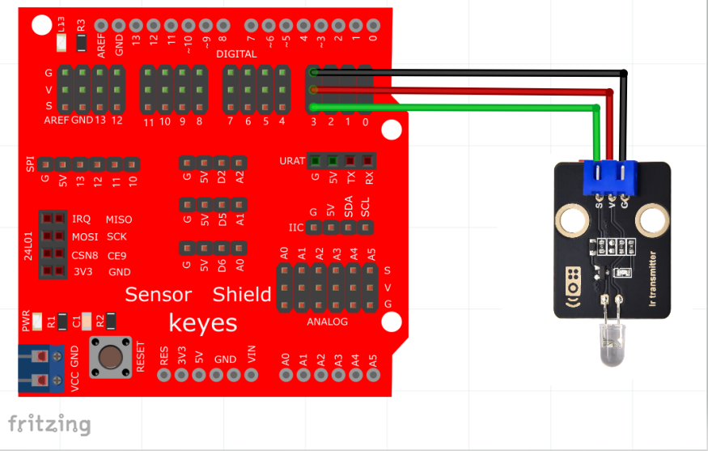
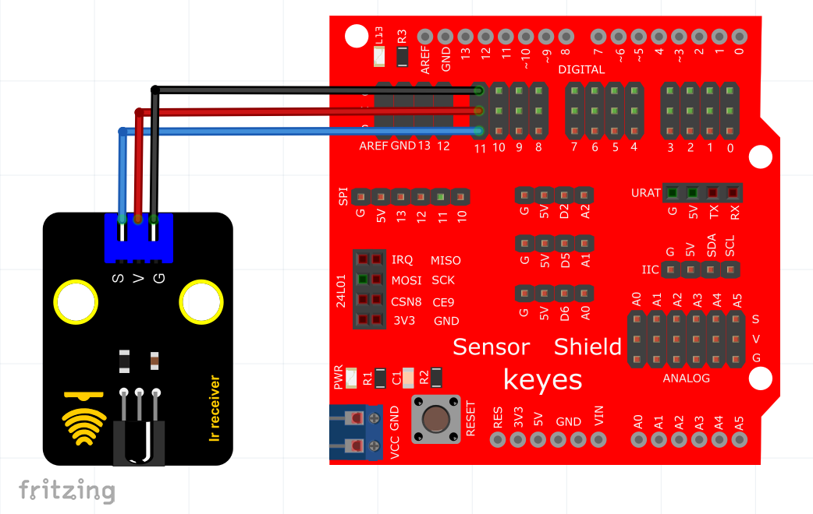
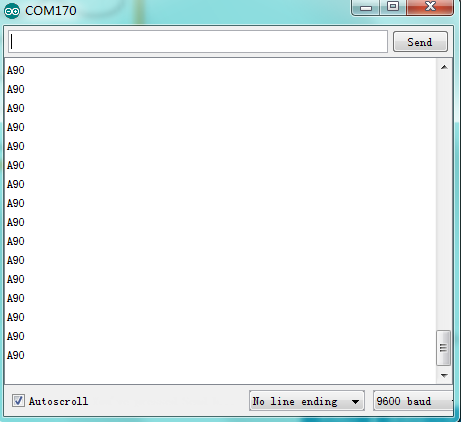

# Arduino


## 1. Arduino简介  

Arduino是一个开源电子原型平台，适合希望进入电子和编程领域的初学者和开发者。它由硬件和软件组成，硬件包括多种类型的开发板，如Arduino UNO和MEGA。Arduino IDE提供了一个简单的环境，用于编写和上传代码到开发板。通过使用Arduino，用户可以轻松实现各种电子项目，如机器人、传感器控制、自动化等。Arduino的图形化编程（如Mixly和Scratch）和丰富的社区资源使得学习变得轻松有趣，并鼓励用户进行创造性思维。  

## 2. 接线图  

红外发射传感器接线图  

  

红外接收传感器接线图（注：本产品里不包含红外接收传感器模块）  

  

这两个模块不能同时接在同一个控制板上使用，接收和发射有冲突。  

## 3. 测试代码（测试软件版本：arduino-1.8.12）  

发射代码  

```cpp  
#include <IRremote.h>  

IRsend irsend;  

void setup() {  
    Serial.begin(9600);  
}  

void loop() {  
    for (int i = 0; i < 50; i++) {  
        irsend.sendSony(0xa90, 12); // Sony电视电源开关编码  
        delay(40);  
    }  
}  
```  

接收代码  

```cpp  
#include <IRremote.h>  

int RECV_PIN = 11; // 定义数字口11  
IRrecv irrecv(RECV_PIN);  
decode_results results;  

void setup() {  
    Serial.begin(9600); // 设置波特率  
    irrecv.enableIRIn(); // 使能红外接收  
}  

void loop() {  
    if (irrecv.decode(&results)) {  
        Serial.println(results.value, HEX); // 显示数据  
        irrecv.resume();  
    }  
}  
```  

## 4. 测试结果  

按照上图分别接好线，烧录好代码；上电后，红外发射传感器对准红外接收传感器发送信号，红外发射传感器和红外接收传感器的D1灯快速闪烁，将接了红外接收传感器的Arduino板接到电脑，我们可以在串口监视器显示“A90”，如下图所示。  




