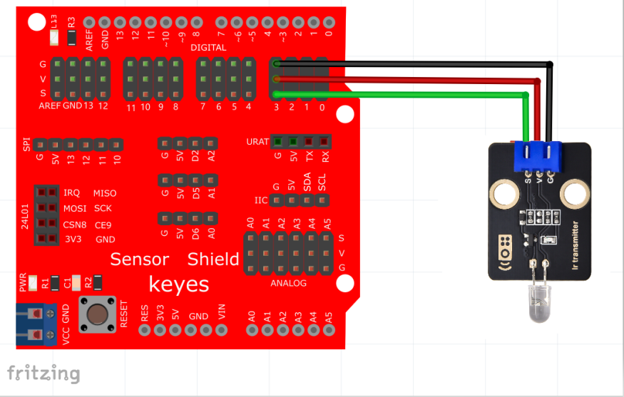

# Mixly

## 1. Mixly简介  

Mixly是一款基于Scratch和Arduino的图形化编程平台，旨在帮助用户，尤其是初学者，学习编程和电子技术。通过拖拽式的编程方式，用户可以轻松创建程序，充分发挥创造力。Mixly支持多种硬件平台，内置丰富的模块和库，适合用于制作机器人、智能家居等项目。其简洁明了的用户界面和丰富的学习资源，使得Mixly成为教育和实践项目的理想选择。  

## 2. 接线图  

红外发射传感器接线图  

  

红外接收传感器接线图（注：本产品里不包含红外接收传感器模块）  

  

> 这两个模块不能同时接在同一个控制板上使用，接收和发射有冲突。  

## 3. 测试代码（测试软件版本：Mixly1.2.0）  

发射代码  

  

接收代码  

  

## 4. 测试结果  

按照上图分别接好线，烧录好代码；上电后，红外发射传感器对准红外接收传感器发送信号，红外发射传感器和红外接收传感器的D1灯快速闪烁，将接了红外接收传感器的Arduino板接到电脑，串口监视器显示“90”，如图所示。  

